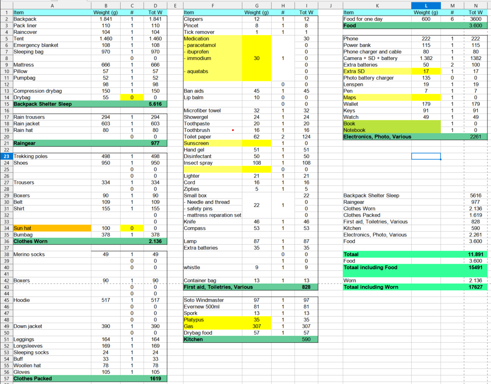
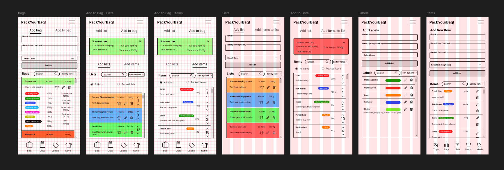
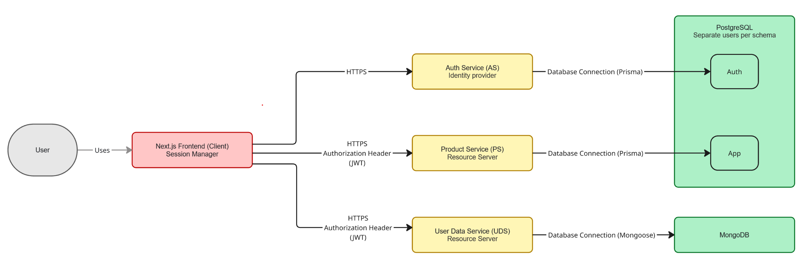
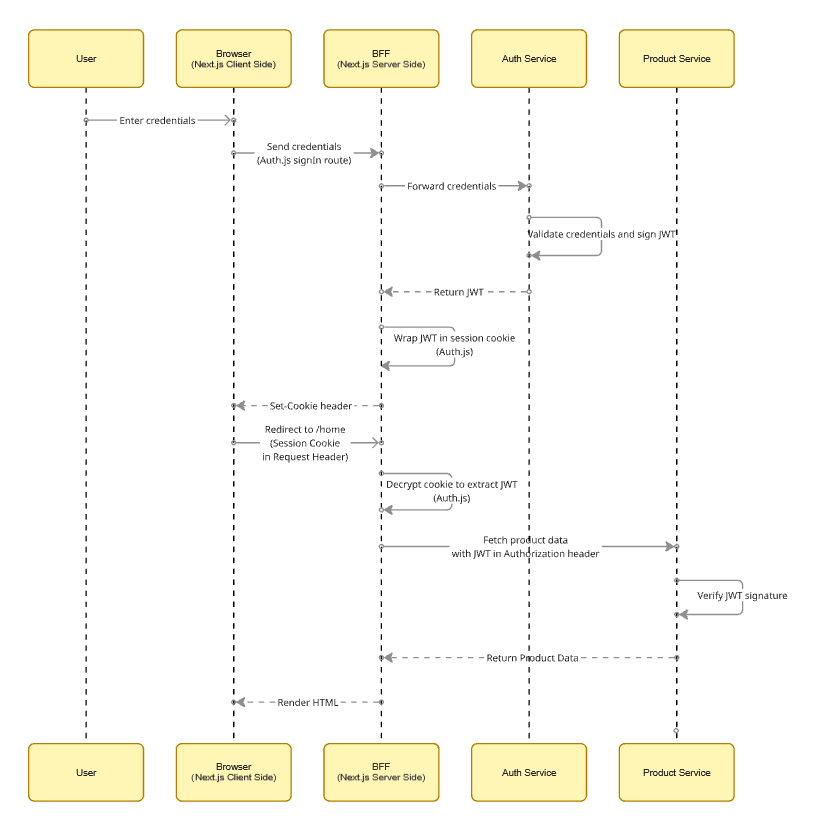
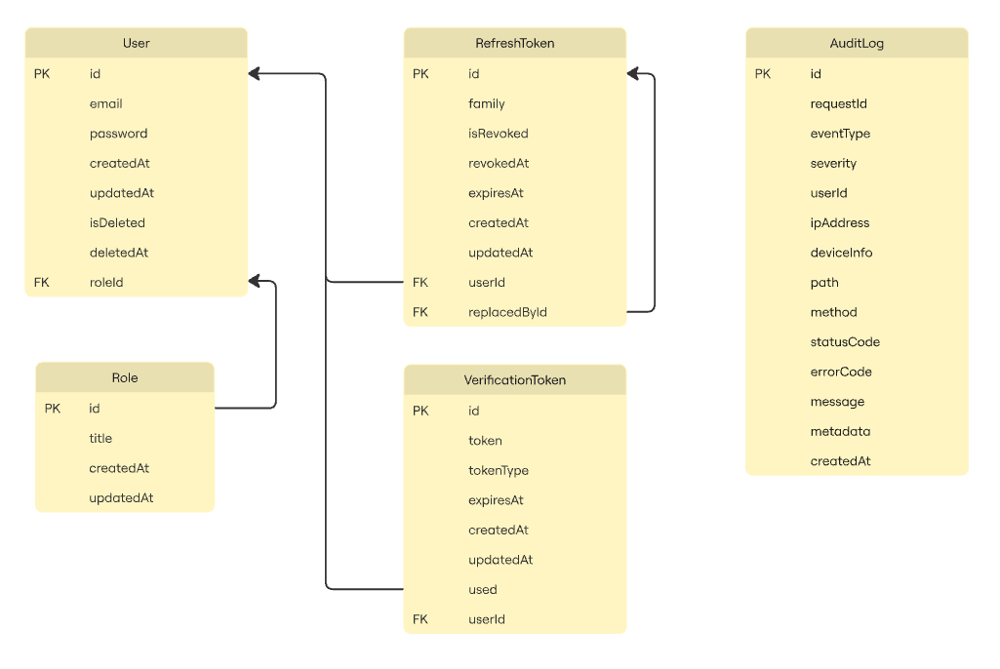
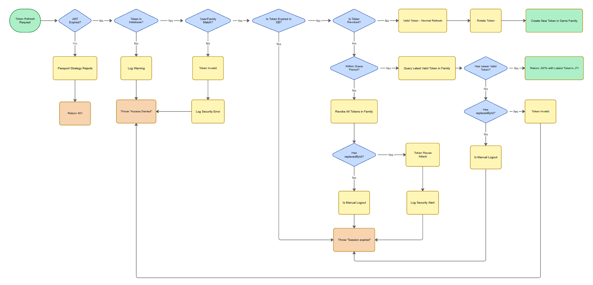
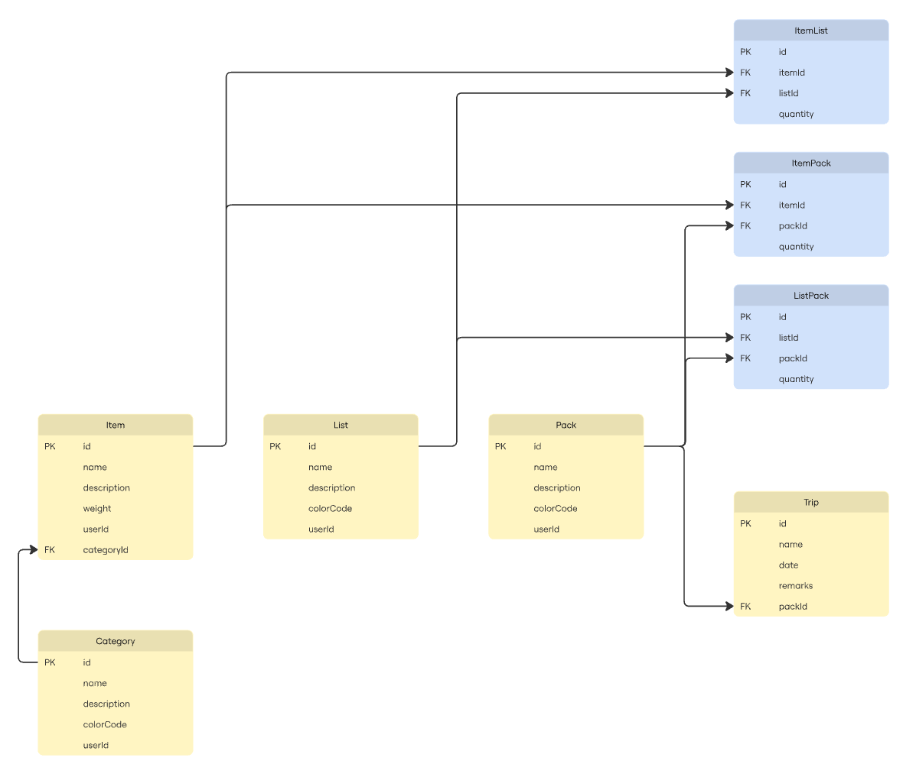
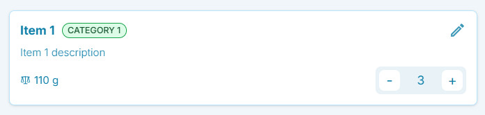

# PackYourBag - Project Overview

Luggage management tool

Work in Progress - `dev` branch is where the amazing stuff is happening right now...

## Contents

- [1. Idea & motivation](#1-idea--motivation)
- [2. Key Features & Project Goals](#2-key-features--project-goals)
  - [2.1 Structured Data Management (The Core Entities)](#21-structured-data-management-the-core-entities)
  - [2.2 Efficient Pack Preparation](#22-efficient-pack-preparation)
  - [2.3 Trip Readiness and Execution (Packing Check-Off)](#23-trip-readiness-and-execution-packing-check-off)
- [3. Development & Skills](#3-development--skills)
- [4. Technical Specifications & Architecture](#4-technical-specifications--architecture)
  - [4.1 Project Architecture & Tech Stack](#41-project-architecture--tech-stack)
  - [4.2 Data Persistence (Database & ORM)](#42-data-persistence-database--orm)
  - [4.3 Authentication](#43-authentication)
- [5. Development Strategy & Roadmap](#5-development-strategy--roadmap)
- [6. Implementation](#6-implementation)
  - [6.1 Phase 0: Development Setup & Foundation](#61-phase-0-development-setup--foundation)
  - [6.2 Phase 1: Identity Provider](#62-phase-1-identity-provider)
  - [6.3 Phase 2: Resource Server (Product Service)](#63-phase-2-resource-server-product-service)
  - [6.4 Phase 3: Resource Server (User Data Service)](#64-phase-3-resource-server-user-data-service)
  - [6.5 Phase 4: Frontend](#65-phase-4-frontend)

## 1. Idea & motivation

As an avid backpacker and long-distance hiker, packing lists have always been a part of my routine. When you're out in the wilderness, finding out you forgot some essential gear is simply not an option. Before starting on a new adventure, I find myself manually ticking off items from a trusty Excel spreadsheet, to make sure nothing gets left behind.

     
    
     
    <i>Example of a messy packing list in progress…</i>

Different trips or seasons require different gear, so my spreadsheet is constantly evolving. It gets copied, extended, pruned, and modified before each trip.

This app evolves the packing list from a rigid spreadsheet into a dynamic, reusable, and flexible packing management system. It should allow users to rapidly generate and customize gear lists for any scenario, and provide a clear interactive checklist when it’s time to pack.

While built for outdoor adventures, the modular architecture could adapt to any scenario requiring hierarchical inventory management.

## 2. Key Features & Project Goals

The application manages packing logistics through a hierarchical data model, enabling users to transition from granular item management to complex, trip-specific configurations.

### 2.1 Structured Data Management (The Core Entities)

The app uses a series of interconnected entities to organize packing data. By decoupling physical inventory (Items) from logical collections (Lists and Packs), the architecture enables users to build modular configurations that can be reused across different trip profiles.

| **Entity** | **Purpose**                                                                                               | **Key Properties**                             | **Relationships**                                |
| ---------- | --------------------------------------------------------------------------------------------------------- | ---------------------------------------------- | ------------------------------------------------ |
| Item       | The basic unit of packing (e.g., a tent, a shirt, a camera battery)                                       | Name (Required), Weight, Description, Category | Can be assigned to a List or directly to a Pack. |
| Category   | Groups items for organization (e.g., Electronics, Shelter, Clothing).                                     | Name (Required), Description                   | Linked to one or more Items.                     |
| List       | A reusable grouping of Items (e.g., "Summer sleeping kit" or "Winter sleeping kit").                      | Name (Required), Description, Color Code       | Can be combined into a Pack.                     |
| Pack       | The final, compiled packing list for a specific need (e.g., "Winter Thru-Hike" or "5-Day Business Trip"). | Name (Required), Description                   | Can be selected for a Trip.                      |
| Trip       | A specific instance of a journey.                                                                         | Name (Required), Description, Date, Remarks    | Uses one Pack as its definitive packing list.    |

### 2.2 Efficient Pack Preparation

- **Composition:** Users can construct Packs by aggregating existing Lists or assigning individual Items, allowing for flexible, high-speed configuration.
- **Prototyping:** Existing Packs can be cloned and modified, serving as templates to minimize redundant data entry for similar trip profiles.
- **Data Aggregation:** The system calculates metadata in the background, providing cumulative weight totals and category breakdowns.

### 2.3 Trip Readiness and Execution (Packing Check-Off)

Once a Pack is assigned to a Trip, the user can transition into the execution phase:

- **Item Verification:** Users can check off items as they are packed, providing an immediate overview of progress and missing gear.
- **Filtered Views:** The system can isolate unchecked items to assist with last-minute needs, such as generating a shopping list for missing consumables or equipment.

## 3. Development & Skills

This project serves as a technical sandbox for implementing production-grade distributed systems. While the core functionality could be achieved with a simpler stack, the architecture and tools were intentionally chosen to practice microservice orchestration, stateless security, and modern developer workflows.

### Key Technical Focus:

- **Distributed Architecture:** Backend-for-Frontend (BFF) pattern with Next.js orchestrating three decoupled NestJS microservices.
- **Stateless Asymmetric Security:** RS256 JWT strategy with public/private key pairs, eliminating inter-service authentication overhead.
- **Polyglot Persistence:** PostgreSQL (Prisma) for relational integrity, MongoDB (Mongoose) for flexible user metadata.
- **System Resilience:** Multi-layered perimeter protection coupled with GDPR-compliant audit logging.
- **Monorepo Orchestration:** Turborepo within a Docker Dev Container for unified tooling and full-stack type safety.
- **Quality Assurance:** Vitest for testing, Storybook for isolated component development.

## 4. Technical Specifications & Architecture

I started with a design-first approach, building a **Figma wireframe** to validate the data model and user flows before implementation.

    
     
    <i>Mobile views wireframe</i>

### 4.1 Project Architecture & Tech Stack

The system follows a decoupled microservices architecture orchestrated via Turborepo, where services are independently scalable and maintainable:

- **Frontend & Orchestrator:** Acts as the Backend-for-Frontend (BFF) and sole entry point to the microservices, aggregating data from downstream microservices.
- **Identity Provider:** Issues and manages RS256-signed JWTs for stateless authentication across the system.
- **Resource Servers:** Domain-specific services for Product data (packing lists, items) and User data (preferences, settings).
- **Infrastructure:** Containerized via Docker with a Dev Container for environment parity, designed for deployment to container-based cloud infrastructure.

 

| **Component**           | **Technology / Framework** | **Rationale & Key Responsibility**                                                             | **Deployment Strategy**   |
| ----------------------- | -------------------------- | ---------------------------------------------------------------------------------------------- | ------------------------- |
| Monorepo Manager        | Turborepo                  | Orchestrates the stack; manages shared configuration and tooling with optimized build caching. | -                         |
| Frontend & BFF          | Next.js (React/RSC)        | UI and Backend-for-Frontend; leverages Server Components for data aggregation.                 | Serverless environment    |
| Authentication          | Auth.js                    | Manages browser sessions and bridges client-side auth to the backend JWT strategy.             | Integrated in BFF         |
| Auth Service (AS)       | NestJS                     | Issues RS256 JWTs; manages user credentials, security logic, and account lifecycle.            | Containerized (Linux/VPS) |
| Product Service (PS)    | NestJS                     | Resource Server: Manages core packing list logic and relational data.                          | Containerized (Linux/VPS) |
| User Data Service (UDS) | NestJS                     | Resource Server: Manages polymorphic user metadata and preferences.                            | Containerized (Linux/VPS) |
| Primary Database        | PostgreSQL (Prisma)        | Ensures ACID compliance for relational data (AS and PS) via logically isolated schemas.        | Managed (TBD)             |
| Flexible Database       | MongoDB (Mongoose)         | Document storage for non-relational user preferences and metadata.                             | MongoDB Atlas             |
| Containerization        | Docker                     | Ensures environment parity across development and multi-cloud deployments.                     | -                         |
| Testing                 | Vitest                     | Executes unit, integration and component tests across the monorepo workspace.                  | -                         |
| Styling & UI            | Tailwind & Storybook       | Utility-first styling and isolated component-driven development.                               | -                         |

 
 

    
     
    <i>System architecture</i>

### 4.2 Data Persistence (Database & ORM)

Data persistence was approached with an enterprise mindset, selecting specialized databases for specific data requirements rather than forcing a "one-size-fits-all" solution.

- **Primary Database: PostgreSQL (via Prisma).** Selected for transactional integrity and robust relationship management. Essential for Auth and Product services, where core entities require strict enforcement of referential integrity.
- **Flexible Database: MongoDB (via Mongoose).** Utilized for the User Data Service to store polymorphic user preferences. Avoids "schema-rot" in the relational database, allowing user-specific settings to evolve without complex migrations.

 

**Architectural Trade-off: Logical vs. Physical Isolation**

In a "Shared Nothing" production environment, each service would ideally own a dedicated physical database instance. To maintain cost-efficiency while respecting this principle, I utilized logical schema separation within a single PostgreSQL instance.
While this creates a shared failure domain at the infrastructure layer, I mitigated data-layer risk by enforcing the Principle of Least Privilege. Each microservice connects via a unique database role restricted exclusively to its own schema, preventing cross-service data leakage.

### 4.3 Authentication

The system implements a stateless, asymmetric authentication strategy designed to maximize service autonomy and minimize cross-service latency.

- **Session Management (BFF):** Auth.js bridges browser-based session management with the backend's JWT security by storing session tokens in encrypted, HTTP-only cookies, mitigating XSS-based token theft.
- **Asymmetric Identity (RS256):** The Auth Service issues a JWT token pair signed with a Private RSA Key (Access Token + Refresh Token). Downstream Resource Servers verify tokens locally using a Public Key, preventing the Auth Service from becoming a performance bottleneck.
- **Token Rotation & Reuse Detection:** Utilizes a "Refresh Token Family" pattern: every refresh issues a new token while invalidating the predecessor. If any token in the chain is reused (signaling a potential breach), the entire family is revoked. A grace period accommodates race conditions and network retries.
- **GDPR-Compliant Audit Logging:** The Auth Service maintains an immutable log of all security events with anonymized IP addresses and truncated User Agent strings (Browser/OS/Device only) before persistence.

## 5. Development Strategy & Roadmap

The project follows a backend-first approach, implementing the identity provider and resource servers first to validate the distributed architecture before building the UI.

| Phase                           | Focus                       | Rationale                                                                                                                                                |
| ------------------------------- | --------------------------- | -------------------------------------------------------------------------------------------------------------------------------------------------------- |
| Phase 0: Environment Foundation | Monorepo & Containerization | Establishes a consistent development environment with shared tooling (Turborepo, Docker, ESLint, TypeScript, Vitest).                                    |
| Phase 1: Identity Provider      | Auth Service                | Builds the security foundation first. All resource servers require JWT tokens for stateless verification, so this must exist before downstream services. |
| Phase 2: Resource Server        | Product Service             | Implements the primary business logic with relational data. Validates that resource servers can successfully verify tokens from the identity provider.   |
| Phase 3: Resource Server        | User Data Service           | Adds a second resource server with document storage. Proves the system is persistence-agnostic and that JWT verification logic is fully decoupled.       |
| Phase 4: Frontend               | Next.js BFF & UI            | Builds the presentation layer once backend APIs are stable. Avoids frontend rework by developing against a validated API contract.                       |

## 6. Implementation

### 6.1 Phase 0: Development Setup & Foundation

The first step was establishing a consistent development environment for building and testing services in isolation.

#### 6.1.1 Monorepo Configuration (Turborepo)

The monorepo was bootstrapped using a [custom Turborepo boilerplate I developed previously](https://github.com/carlfremault/turbo-tryout), which includes a frontend, backend, and shared configuration packages for TypeScript, ESLint, and Vitest.

After removing the default Express.js backend, I had a clean foundation for the NestJS microservices.

#### 6.1.2 Dev Container setup (Docker)

To ensure a consistent Developer Experience (DX) and simplify the eventual transition to production, I wrapped the entire monorepo in a Docker Dev Container. This setup automates the toolchain configuration with a "batteries included" approach:

- **Integrated Tooling:** Built from a Node 24/TypeScript base image with automated installation of Turborepo, NestJS CLI, and Yarn 4 (via Corepack).
- **Local Infrastructure:** Includes a PostgreSQL service in the Docker Compose configuration. The dev container shares the network stack with the database (`network_mode: service:postgres_db`), allowing services to connect via `localhost:5432`, matching production connection patterns and simplifying environment configuration.
- **VS Code Integration:** Automatically configures VS Code workspace settings and installs extensions (Prisma, ESLint, Tailwind) on container launch via `devcontainer.json`.

### 6.2 Phase 1: Identity Provider

#### 6.2.1 Design & Data Modeling

Before writing any code, I mapped out the authentication flow and data structures to ensure the service would be both secure and stateless.

##### Authentication Flow (Sequence Diagram)

I designed a sequence diagram to visualize the flow between the browser, BFF, and backend services. Key security boundaries include credential validation in the Auth Service, JWT wrapping in encrypted session cookies (never exposed to the browser), and stateless verification in resource servers using the public key.

     
    
     
    <i>Authentication Sequence Diagram</i>

##### Database Schema (ERD)

The schema defines relationships between Users, Roles, and RefreshTokens to support token family tracking and immediate revocation.

- **UUID v7 identifiers** for time-ordered database performance while maintaining global uniqueness.
- **Decoupled AuditLog table** (no foreign keys) to preserve log immutability even after user deletion.
- **Salted password hashes** to ensure no plaintext credentials exist in the database.
- **VerificationToken table** for time-limited, single-use tokens supporting password reset and account deletion workflows.

     
    
     
    <i>Auth Service Entity Relationship Diagram</i>

#### 6.2.2 Bootstrapping & Monorepo Integration

After generating the service with the NestJS CLI, I aligned it with the monorepo architecture:

- **Configuration Alignment:** Extended shared TypeScript and ESLint packages to ensure consistent linting and compiler settings across microservices.
- **Vitest Migration:** Replaced the default Jest setup with Vitest for better monorepo performance and native ESM support.
- **Turborepo Integration:** Added the service to the Turborepo pipeline, enabling root-level commands (`dev`, `build`, `test`) to manage all workspace packages.
- **API Documentation & Type Safety:** Integrated Swagger with full endpoint annotations. Generated an OpenAPI spec to automatically create a typed HTTP client as a shared monorepo package, ensuring type-safe API consumption across services.

To avoid repeating this manual configuration, the service was cloned twice to bootstrap the Product and User Data Services (Phases 2-3).

#### 6.2.3 Infrastructure & Security Setup

With the foundation ready, I configured the service infrastructure:

- **Prisma Initialization:** Connected Prisma to the local PostgreSQL container and pushed initial migrations to establish the user tables.
- **Cryptographic Keys:** Generated an RSA key pair for RS256 signing. The Private Key remains isolated to the Auth Service, while the Public Key is shared with resource servers for token verification. Both are injected via environment variables.

#### 6.2.4 Service Implementation

With the infrastructure in place, I built a robust API following NestJS best practices, prioritizing security and observability.

##### Authentication Flow

Manual RS256 token signing was implemented for outbound logic, Passport.js strategies for inbound verification (Access and Refresh strategies). The system supports full lifecycle management: registration, login, token rotation with "family" tracking, and global sign-out.
To handle edge cases like concurrent requests and reuse attacks, I designed the following decision matrix for refresh token validation:

| **Scenario**             | **Stored Token Status (isRevoked)**         | **Within Grace Period** | **Action**                                                                            | **Client Message** | **Internal log**                             | **AuditLog EventType**         |
| ------------------------ | ------------------------------------------- | ----------------------- | ------------------------------------------------------------------------------------- | ------------------ | -------------------------------------------- | ------------------------------ |
| Normal refresh           | Valid (not revoked, not expired)            | N/A                     | Rotate token, create new one in same family                                           | N/A                | N/A                                          | TOKEN REFRESHED                |
| Race condition           | Revoked                                     | Yes                     | Query latest valid token in family. Return JWTs with latest token's JTI (no DB write) | N/A                | Race condition handled: user [ID]            | TOKEN REFRESHED RACE CONDITION |
| Token reuse attack       | Revoked AND has `replacedById`              | No                      | Revoke all tokens in family. Log security alert. Throw exception                      | "Session expired”  | Critical: Token reuse detected for user [ID] | TOKEN REUSE DETECTED           |
| Manual logout            | Revoked AND no `replacedById`               | Yes                     | Throw exception                                                                       | "Session expired”  | N/A                                          | SESSION EXPIRED                |
| Manual logout            | Revoked AND no `replacedById`               | No                      | Throw exception                                                                       | "Session expired”  | Refresh attempt on logged-out session        | SESSION EXPIRED                |
| Token not found in DB    | NULL                                        | N/A                     | Log warning. Throw exception                                                          | "Access Denied”    | Warn: Refresh token [ID] not found in DB     | INVALID SESSION                |
| Token ownership mismatch | Found but `userId` or `family` mismatch     | N/A                     | Log security error. Throw exception                                                   | "Access Denied”    | Security: User [ID] mismatch for token [ID]  | INVALID SESSION                |
| Token expired in DB      | Valid (not revoked) but `expiresAt < now()` | N/A                     | Throw exception                                                                       | "Session expired”  | N/A                                          | SESSION EXPIRED                |
| JWT expired              | N/A (never reaches service)                 | N/A                     | Passport strategy rejects. Returns 401 before service method called                   | "Unauthorized”     | N/A                                          | SESSION EXPIRED                |

     
    
     
    <i>Refresh token decision flow visualizing the scenarios above</i>

##### Account Lifecycle & Recovery

- **Forgot Password:** Implements a time-limited password reset flow using hashed verification tokens (15-minute expiration). Prevents user enumeration by returning generic success messages regardless of email existence.
- **Account Deletion:** Supports GDPR-compliant user deletion with a 30-day grace period. Users receive a verification token via email to cancel deletion before final anonymization of audit logs and hard deletion of user data.
- **Email Notifications:** Implemented email delivery for password reset and account deletion flows using Nodemailer with server-side template rendering.

##### Network Security

- **BFF Guard (Service-to-Service):** To protect internal microservices from direct access in cloud environments where dynamic IP allocation prevents traditional IP whitelisting, I implemented a shared-secret header requirement. Any request bypassing the Next.js BFF is immediately rejected.
- **Intelligent Throttling:** Custom `ThrottlerGuard` differentiates between anonymous (IP-based) and authenticated (user ID-based) requests. This prevents users behind NAT from being penalized while protecting against proxy-rotation attacks.
- **Strict CORS Policy:** Production API is locked to only accept requests from the Next.js BFF, prohibiting direct browser-to-API communication.
- **Global Exception Filtering:** System-wide filter ensures the API always returns consistent JSON structures instead of HTML error pages or stack traces that could reveal internal file paths.

##### Audit & Observability

- **Comprehensive Coverage:** Custom exception filters and an `AuditInterceptor` record every interaction (successes, errors, throttled requests). I chose NestJS Interceptors over Middleware because interceptors execute after route resolution and can access both request/response data and custom decorator metadata (e.g., `@AuditLog('LOGIN_SUCCESS')`), enabling richer event logging.
- **Information Sanitization:** Internal logs capture detailed events (`TOKEN_REUSE_DETECTED`) while clients receive sanitized messages (`Session Expired`).
- **Async Performance:** Logs are dispatched asynchronously via NestJS EventEmitter to prevent blocking user requests.
- **GDPR Compliance:** IP addresses are anonymized and User Agent data is limited to browser/OS/device. User deletion requests trigger a 30-day soft-delete period before final anonymization of audit logs.
- **Error Tracking:** Integrated Sentry for production error monitoring without transmitting PII. Each request receives a unique ID via middleware, allowing correlation between Sentry alerts and audit logs for debugging.

##### Scheduled Maintenance

Daily cron jobs clean up expired data with configurable retention periods:

- **Refresh Tokens:** Expired tokens deleted immediately; revoked tokens after 14 days.
- **Audit Logs:** INFO (30 days), WARN/ERROR (60 days), CRITICAL (90 days).
- **Deleted Users:** Final deletion and log anonymization after 30-day grace period.
- **Verification Tokens:** Expired tokens deleted after 1 day, used tokens deleted immediately.

##### Testing & Quality Assurance

Implemented comprehensive test coverage across unit and integration scenarios using Vitest. This prevented regressions during subsequent feature development, particularly when adding the token family rotation and audit logging systems.

### 6.3 Phase 2: Resource Server (Product Service)

#### 6.3.1 Shared Package Extraction

Before building the Product Service, I extracted reusable infrastructure from the Auth Service into two shared monorepo packages.

**`@repo/db`** moved the entire Prisma setup — schema definitions, generated client, migrations, and seed scripts — into a standalone package. Both services share the same PostgreSQL instance under separate schemas, so centralizing the ORM layer was the natural move. This extraction also surfaced a dormant permissions issue: migrations had been running under the Auth Service's database role, which only holds privileges on `app_auth`. The setup script was corrected to scope each role exclusively to its own schema, enforcing the Principle of Least Privilege at the migration level, not just at query time.

**`@repo/nestjs-common`** consolidated the guards, Passport strategies, decorators, exception filters, middleware, and testing helpers that every resource server would need. Downstream services now import pre-wired NestJS modules (`JwtAuthModule`, `BffGuardModule`, `CustomThrottlerModule`) and register them with a few lines of configuration.

#### 6.3.2 Design & Data Modeling

The database schema centers on three primary models — `Item`, `List`, and `Pack` — connected through junction tables that carry their own payload (e.g., `quantity`). `Category` provides optional grouping. `Trip` references a single Pack. All entities carry a `userId` field with ownership enforced at the service layer.

     
    
     
    <i>Product Service Entity Relationship Diagram</i>

#### 6.3.3 Delete Impact Resolution

The most interesting design challenge in this service was delete handling. The dependency graph runs deep: removing a List cascades through `ListPack` to Packs, and from there to Trips. An Item can affect ItemList, ItemPack, Packs, and Trips. A client cannot reasonably track these implications on its own.

To address this, every deletable entity exposes a `GET /:id/delete-impact` endpoint that traverses the full dependency graph and returns all affected records — without modifying any data. The client presents these consequences to the user and only proceeds to `DELETE /:id` on confirmation.

| **Entity deleted** | **Impact reported**                                                                                       |
| ------------------ | --------------------------------------------------------------------------------------------------------- |
| Category           | Items that will lose their category assignment (`categoryId` nulled, items not deleted)                   |
| Item               | Lists and Packs containing this item (`Restrict` — delete blocked until removed); Trips using those Packs |
| List               | Packs containing this List (`Restrict` — delete blocked until removed); Trips using those Packs           |
| Pack               | Trips that will lose their Pack reference (`packId` nulled, Trips not deleted)                            |
| Trip               | No downstream impact                                                                                      |

Beyond delete handling, the service follows established patterns: full CRUD across all modules with Prisma transactions for multi-step writes, UUID v7 identifiers, `class-transformer` DTOs for response shaping, and comprehensive unit and integration tests against the real PostgreSQL container. A typed HTTP client (`product-client`) was generated from the OpenAPI spec following the same approach as Phase 1.

### 6.4 Phase 3: Resource Server (User Data Service)

#### 6.4.1 Infrastructure Payoff

The User Data Service was the first service to fully benefit from the shared packages extracted during Phase 2. Where the Auth Service required building all NestJS plumbing from scratch, and the Product Service paid the upfront cost of extracting that infrastructure into reusable libraries, the User Data Service simply consumed the result.

Wiring up authentication, throttling, the BFF guard, exception handling, and observability amounted to module imports and a handful of configuration constants. The service went from bootstrap to passing tests faster than any previous phase — a concrete return on the investment made during Phase 2.

#### 6.4.2 MongoDB & Data Modeling

The only new territory was MongoDB. The User Data Service manages a single `Preference` collection — one document per user — storing display preferences (units, theme, date/time format). With no relational dependencies and a schema expected to evolve without coordinated migrations, document storage was the natural fit.

A `MongooseExceptionFilter` was built following the same structural pattern as the `PrismaExceptionFilter` in the other services, mapping MongoDB-specific errors to consistent HTTP responses.

As part of generating the `user-data-client` package, all three HTTP clients (`auth-client`, `product-client`, `user-data-client`) were aligned to the same template, standardizing the `SuccessResponse` and `RequestBody` type utility exports across the monorepo.

### 6.5 Phase 4: Frontend

With three backend services operational and their typed HTTP clients published, the focus shifted to the presentation layer. Before building the UI, I extended the Auth Service with email verification. The phase then followed two stages: a shared component library built in isolation, then integration into the Next.js application with real data and routing.

#### 6.5.1 API Contract & Type Generation

Each HTTP client package (`auth-client`, `product-client`, `user-data-client`) takes the service's OpenAPI spec as its single source of truth. Two artifacts are generated from that spec:

- **TypeScript types** via `openapi-typescript`: strongly-typed request and response interfaces that track any API change.
- **Zod schemas** via `openapi-zod-client`: runtime validation schemas for request bodies, surfacing errors at the form layer without duplicating schema definitions.

Backend contract changes propagate automatically to frontend types and validators — no manual schema maintenance, no drift between validation and API shape.

#### 6.5.2 Authentication Extension

I extended the Auth Service with an email verification flow using time-limited tokens, blocking protected resource access for unverified accounts. This completed the account lifecycle alongside the password reset and deletion flows already in place.

#### 6.5.3 Component Library (`@repo/react-common`)

The UI components live in `@repo/react-common`, following the shared-package pattern established in Phases 2–3.

The design system supports full light and dark mode via a semantic token layer, with theme changes propagating without touching component code. Entities requiring visual differentiation (Categories, Lists, Packs) use a 10-color palette via a `colorTheme` prop.

All components are purely presentational: no data fetching, no API calls, no internal state management beyond controlled inputs. Data enters through typed props; user interactions propagate upward via callback props (`onEditItem`, `onOpenCollection`). This draws a hard boundary between UI and logic — components don't know where their data comes from or what happens when a button is clicked.

     
    
     
    <i>Desktop header</i>

Where a component needs to behave differently across contexts, it uses composition over conditional logic. E.g. `ItemCard` accepts an `actions` slot as a `React.ReactNode` prop — a quantity stepper in list view, Edit/Delete buttons in items view — no boolean flags or internal branching required.

     
    
     
    <i>Item card with quantity stepper</i>

#### 6.5.4 Component-Driven Development with Storybook

Components in `@repo/react-common` have a colocated Storybook story file. Stories serve as the source of truth for a component's valid states — if a state isn't in a story, it isn't designed. This replaces the traditional cycle of spinning up the full app, logging in, navigating to the right screen, and creating test data just to verify a visual change. Each story covers the happy path, meaningful visual variants, and layout-breaking edge cases (1000-character descriptions, missing optional props, zero-item states).

#### 6.5.5 Application Integration

With the component library stable, integration into the Next.js app leaned into the async React paradigm: Server Components prefetch data before rendering, with Suspense boundaries and skeleton fallbacks handling the async client layer. This keeps the data-fetching waterfall on the server and eliminates loading spinners on initial navigation.

Accessibility was treated as a first-class concern throughout — ARIA attributes, keyboard navigation, screen reader support, and semantic markup applied consistently across all routes.

## License

Distributed under the MIT License. See [LICENSE](LICENSE) for more information.

Copyright (c) 2025 Carl Fremault

---
